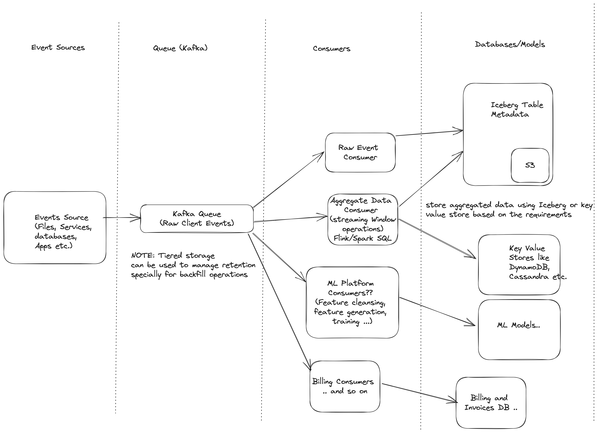

# ps-simple-events-aggregator
Python repo for aggregating simple events and expose uvicorn server for querying data by 1 hour buckets

The file `events.csv` contains a log of events with csv format _customer_id_, _event_type_, _transaction_id_, _timestamp_ (with_tz).

Task is to write a program that answers the following question:

> How many events did customer X send in the one hour buckets between timestamps A and B.  
> **NOTE** : These are not sliding windows but fixed 1 hour windows keyed by start of the hour

# Setup
#### 1. Create Virtual Environment and install dependencies
- Create python virtual environment 
  > python3 -m venv events-venv
- Activate venv
  > source events-venv/bin/activate
- Install dependencies
  > pip install -r requirements.txt

#### 2. Setting DynamoDB to run locally
- Download jar from [AWS DynamoDB Local](https://docs.aws.amazon.com/amazondynamodb/latest/developerguide/DynamoDBLocal.DownloadingAndRunning.html)
- Create a dummy ~/.aws/config file and a dummy ~/.aws/credentials file if you don't have one. Even if we are running DynamoDB locally it is needed to pass 
credentials check.
  > [default]  
  > aws_access_key_id = dummy_access_key  
  > aws_secret_access_key = dummy_secret_key  
  > region = us-west-2  
  > output = json 

  NOTE : Can also use [Aws cli](https://aws.amazon.com/cli/) to configure these parameters
  > aws configure
- Start DynamoDB Local  
  > java -Djava.library.path=./DynamoDBLocal_lib -jar DynamoDBLocal.jar -sharedDb -port 9000
- DynamoDB Local is now running and listening on http://localhost:9000. It can be interacted with '**_boto3_**' python library
- create **.env** file and put below configs
  - DYNAMODB_ENDPOINT_URL (by default it takes http://localhost:9000 created above, change if you are running on diff port)
  - DYNAMODB_EVENTS_TABLE_NAME (by default it creates 'customer_events' table)

# How to Run 
Go to the root folder and then run
## 1. Ingest the events from csv file into Dynamo DB
> python3 ingest_events_from_file.py resources/events.csv   

## 2. Host Events Query App
> uvicorn events.app:app --reload --port 8800

## Events App  

This is responsible for events. Currently, it just has single GET endpoint for time based range queries for customer_id. But it can be extended for more endpoints.

- For a customer, get all event buckets for given time range
  -  **"/events/customers/{customer_id}/buckets"** - GET events buckets for time range
    - **NOTE** the timestamp needs to be **_ISO 8601 UTC_** format, for example "2021-03-01T04:01:07.450000Z"
      - To convert a ``date`` to this format using python perform below steps 
      > from dateutil.parser import parse  
       import pytz  
       dt = parse(timestamp) # Parse the timestamp string  
       utc_dt = dt.astimezone(pytz.UTC) # Convert to UTC timezone  
       iso_utc = utc_dt.strftime('%Y-%m-%dT%H:%M:%S.%fZ') # Format as ISO 8601 UTC timestamp
      - Or just use the ``convert_to_iso_8601_utc`` method defined in ``ingest_events_from_file.py``
  

### Tech Stack
The app  is built in python using the **Fast API**. It uses:
- **Dynamo DB** to store events table
- **boto3** Library to interact with DynamoDB
  - NOTE: The tables are auto-created using the boto3 client
- **Pydantic** - for validating incoming API requests
- **CORS** middle ware to catch validation errors and return appropriate 400 status code
#### **Code Structure**
##### Events
  - **_app_** - Contains Fast API App and all the api endpoints
  - **_dao_** - contains the DAO methods to create and get items from DynamoDB.
  - **_datamodels_** - Contains the DB definitions
  - **_models_** - Contains all the request response objects for the APIs. Also, the model implement DynamoDBItem 
interface to convert to Dynamo DB item for storing in the DB.
  - **_service_** - Contains all the service method to facilitate the APIs. Separates the data storage
from the API layer
- **_sample_api_requests_** - Calls all the APIs and prints query result for analysis. Can add a test cases to assert query results.

## Tradeoffs
- **DynamoDB vs Object Storage (S3) for storing raw events** 
  - DynamoDB helped to dedupe events since we are storing by customer_id (pkey) and sort key of timestamp-event_type-transaction_id
    - which makes it unique and provides inbuilt deduplication
  - Also used DynamoDB for running it locally and quick proto-typing but in real world there might be billions of events 
  produced in a day for which DynamoDB is not suitable instead the architecture can be improved like
    - Store the events received in a Kafka queue. This can help to handle both bounded and un-bounded streams of data with same code base
    - Store the events in an object store like S3 and define table metadata information in Iceberg to query the events.
    This will reduce the cost as well improve scalability.
    -  If queries will be run for just historic data, we can run batch job in Spark/Flink to query Iceberg for event in date range and aggregate them and store in either a separate Iceberg table or a Key value store like DynamoDB 
    - If we also need realtime ingestion of events then and queries like ``get events in the last 1 hour`` then running stream aggregation for de-duplicating events and aggregating for 1 hour windows might be required
      - NOTE: For unbounded streams, in order to avoid the state growing out of control we will need to set som  

- **Partition Key of using customer_id vs customer_id along with event_type etc.**
  - Customer_id alone could create hot partitions if a particular customer produces a lot of data. 
    - This can cause uneven workload across partitions. 
    - Also, it can lead to performance issues and throughput limitations.
  - But since our query pattern is like get all the events for the customer in a time range, partition key of customer_id alone helps to fetch the results.
  
- **Pre aggregating the events into buckets vs aggregating on runtime**
  - Current solution aggregates the count in the buckets on runtime, therefore if we have lots of queries for a time range then it will be a duplicate and resource intensive effort.
  - Moreover, the load on DB as well as network transfer cost (fetching from DB) will be high.
  - Decided to compute on runtime to simplify the solution for simple queries, but based on query pattern we can evolve this architecture to do pre-compute and store aggregated data.

- **Storing raw timestamp in different timezones vs storing them all as ISO 8601 in UTC**
  - Decided to convert the timestamp into ISO 8601 utc format before storage for two reasons:
    1. Use DB to perform range based queries on the timestamp, this won't be possible if the timestamps are not defined in a uniform manner.
    2. It makes the contract of the system (API interface) simplified, basically all timestamps should be in the ISO 8601 in UTC
       1. Though for range queries for flexibility reasons we can allow timestamp in any format and convert to ISO 8601 in UTC before querying the service/databases.

## Proposed Architecture
If we need to support this in production, here is my proposed high level architecture.
NOTE: It just contains the storage paths and not Query layer. We can have different apps/services querying the data. Also the table structure will also depend on type of queries to be supported.
